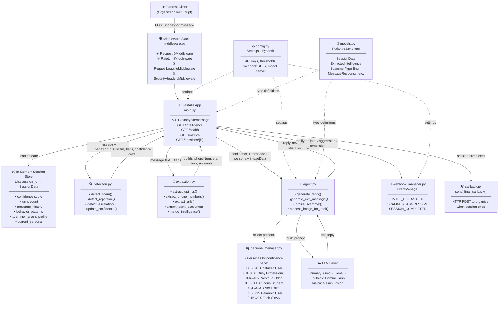
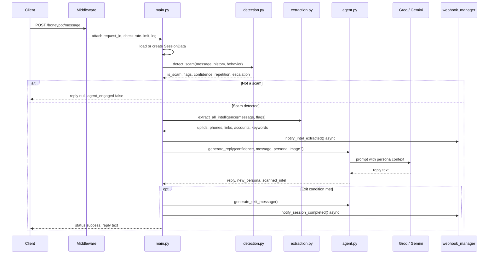

# 🍯 Honey-Pot Scam Detection API — Architecture

> AI-powered FastAPI backend that intercepts scam messages, engages scammers with realistic personas, and extracts intelligence (UPI IDs, phone numbers, phishing links, bank accounts).

---

## Module Architecture

---

## Request Lifecycle — `POST /honeypot/message`

---

## Persona Switching by Confidence

```mermaid
flowchart LR
    C10["confidence ≥ 0.8\n😕 Confused User"]
    C08["0.6 – 0.8\n💼 Busy Professional"]
    C06["0.5 – 0.6\n👴 Nervous Elder"]
    C05["0.4 – 0.5\n🎓 Curious Student"]
    C04["0.3 – 0.4\n🙏 Over-Polite"]
    C03["0.15 – 0.3\n😰 Paranoid User"]
    C015["< 0.15\n🔬 Tech-Savvy Skeptic"]
    EXIT["🚪 Exit + Final Callback"]

    C10 -->|"confidence drops"| C08
    C08 --> C06
    C06 --> C05
    C05 --> C04
    C04 --> C03
    C03 --> C015
    C015 -->|"exit triggered"| EXIT
```

---

## Intelligence Extraction Targets

| Category | Regex Pattern | Example |
|---|---|---|
| **UPI IDs** | `user@provider` | `scammer@paytm` |
| **Phone Numbers** | `+91` / `91` / `6-9XXXXXXXXX` | `9876543210` |
| **Phishing Links** | `http://`, `www.`, `domain.tld` | `verifybank.co/login` |
| **Bank Accounts** | 11–18 digit numbers | `012345678901` |
| **Suspicious Keywords** | Scam keyword flags | `urgent`, `otp`, `kyc` |
| **Image OCR** | Gemini Vision on base64 image | QR codes, UPI screenshots |

---

## Key Files

| File | Role |
|---|---|
| `main.py` | FastAPI app, all endpoints, session store, orchestration |
| `detection.py` | Rule-based scam detection, confidence scoring |
| `extraction.py` | Regex-based intelligence extraction |
| `agent.py` | LLM reply generation, image OCR, scammer profiling |
| `persona_manager.py` | 7 dynamic personas, confidence-based switching |
| `middleware.py` | Request ID, logging, rate limiting, security headers |
| `webhook_manager.py` | Async real-time event notifications |
| `callback.py` | Final session-end HTTP callback to organizer |
| `config.py` | All settings via Pydantic (env vars) |
| `models.py` | All Pydantic schemas and enums |
